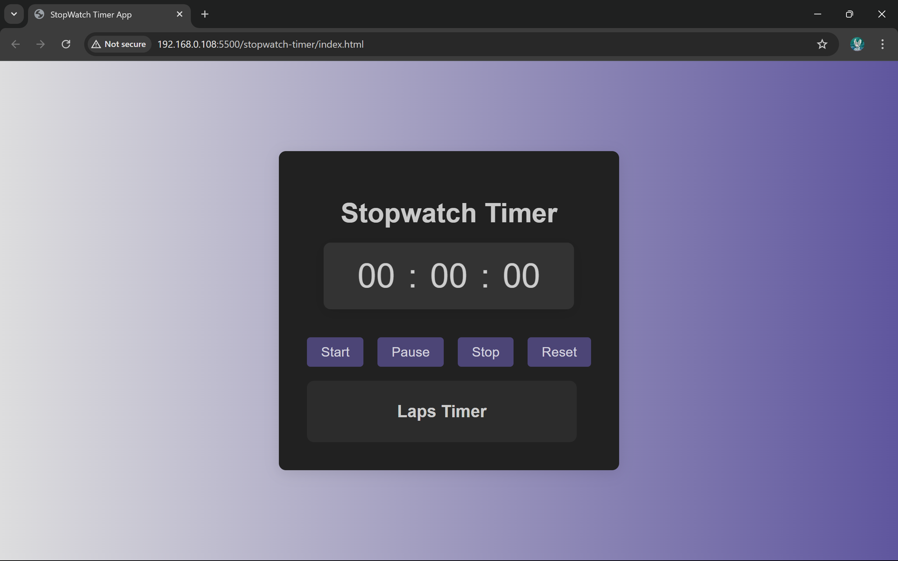
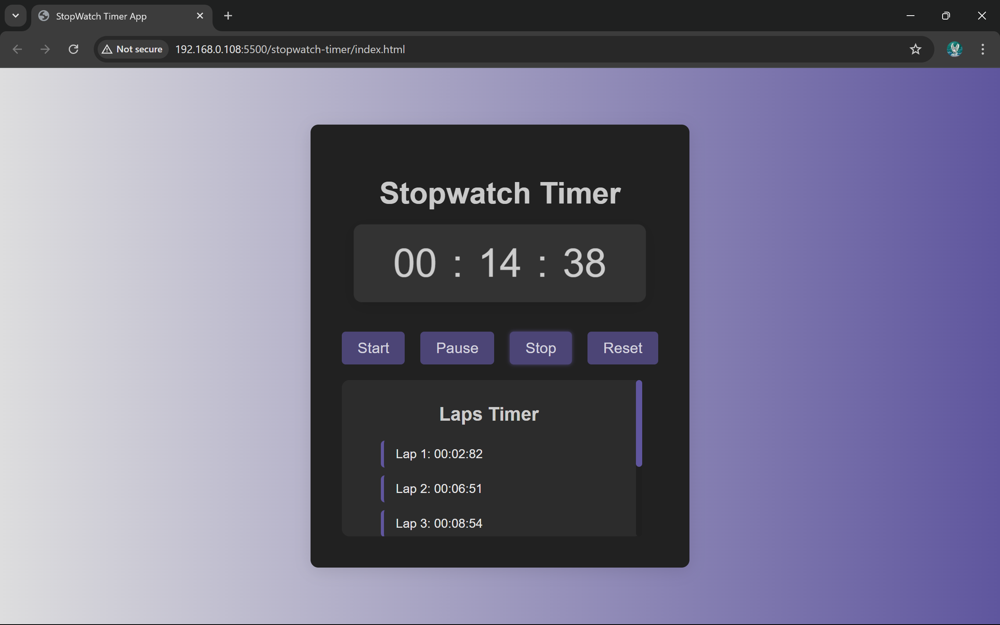
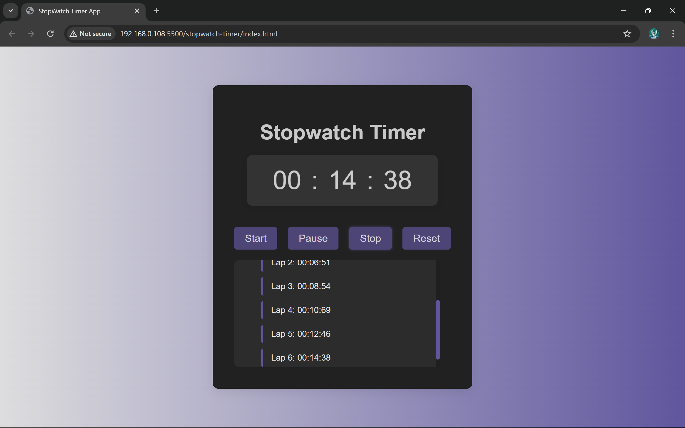

# ⏱️ Project 1: StopWatch Timer

This is a simple stopwatch web app built using HTML, CSS, and JavaScript.  
It allows users to **start**, **pause**, and **reset** the timer — perfect for learning JS DOM manipulation and timing functions.

---

## 📸 Screenshot





---

## 💡 Features

- Start the stopwatch
- Pause and resume the timer
- Reset the timer to 0
- Simple and responsive design

---

## 🧠 Concepts Covered

- `setInterval()` and `clearInterval()`
- DOM manipulation
- Event listeners
- CSS Flexbox (if used)

---

## 🚀 How to Run

1. Clone the repository or download the project
2. Open `index.html` in any modern browser
3. Use the buttons to control the stopwatch

---

## 📁 Folder Structure

```text
stopwatch-timer/
├── index.html
├── style.css
├── script.js
├── website-look/
    ├── stopwatch-screenshot1.png
    ├── stopwatch-screenshot2.png
    ├── stopwatch-screenshot3.png
└── README.md
```
